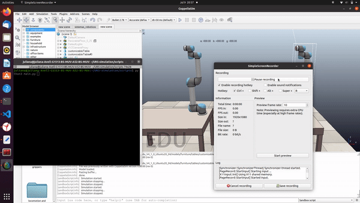

# UR5 Robotic Arm Project

This project implements the forward and inverse kinematics of the UR5 robotic arm and demonstrates their usage in a simulation environment. It also includes the implementation of trajectory planning for joint space using different approaches.

## Table of Contents

- [Project Description](#project-description)
- [Setup](#setup)
- [Etapa A1](#etapa-a1)
- [Etapa A2](#etapa-a2)

## Project Description

The goal of this project is to develop and validate the forward and inverse kinematics of the UR5 robotic arm. Additionally, a trajectory planning system for joint space is implemented using the Cubic Polynomial method.

The project consists of the following components:

- `UR5Kinematics`: This module contains the implementation of the forward and inverse kinematics equations for the UR5 robotic arm.

- `UR5Simulation`: This module provides simulation capabilities for controlling the UR5 robotic arm within the CoppeliaSim environment.

- `main.py`: This script demonstrates the usage of the forward and inverse kinematics functions by executing predefined movements of the UR5 robotic arm.

## Setup

To run this project, follow the instructions below:

1. CoppeliaSim: Install the CoppeliaSim simulation software. You can download it from the official website [Coppelia Robotics](https://www.coppeliarobotics.com/).

2. Clone the Repository: 
   - Clone this repository to your local machine using the following command:
     ```
     git clone https://github.com/julianamaria30/UR5-simulation.git
     ```

3. CoppeliaSim Configuration:
   - Open CoppeliaSim and import the provided scene file from the repository.
   - To ensure the correct configuration, make sure the server side is running in CoppeliaSim.  In a child script of the UR5 robot, check if the following command is set up to execute just once at the simulation start:
     ```
     simRemoteApi.start(19999)
     ```
   - Start the simulation in CoppeliaSim.

4. Python Dependencies:
   - Install the required Python dependencies by running the following command:
     ```
     pip install numpy transforms3d
     ```

## Etapa A1

In this stage, the goal is to implement the forward and inverse kinematics of the UR5 robotic arm. The modeling can be validated using the simulator. By executing the main.py script, you can validate the modeling of the UR5 robotic arm by observing the calculated forward kinematics and ensuring that the inverse kinematics solution matches the desired end effector poses.

<div align="center">
  
</div>


The `UR5Kinematics` module provides the implementation of the forward and inverse kinematics equations for the UR5 robotic arm. By using this module, you can calculate the forward kinematics and inverse kinematics for specific joint configurations and end effector poses.

The `main.py` script showcases the usage of these functions, demonstrating the calculations of forward kinematics and inverse kinematics.

To execute this demonstration run the Main Script:
   - Navigate to the project directory on your local machine.
   - Run the main script using the following command:
     ```
     python main.py

      ```

## Etapa A2


# Authors

This project was developed as part of the "Sistemas Robóticos" discipline at UFBA (Federal University of Bahia) with the support and guidance of Professor André Scolari.

This project was developed by:

- [Everton Cerqueira](https://github.com/everton-cerqueira)
- [Juliana Santana](https://github.com/julianamaria30)


# References

1. Rasmus Skovgaard Andersen. **Kinematics of a UR5**. Aalborg University.

2. Craig, J. J. (2005). **Introduction to Robotics: Mechanics and Control**, Volume 3. Pearson/Prentice Hall Upper Saddle River, NJ, USA.

3. Ryan Keating. **UR5 Inverse Kinematics**. Accessed on: [SlideShare](https://www.slideshare.net/RyanKeating13/ur5-ik).
